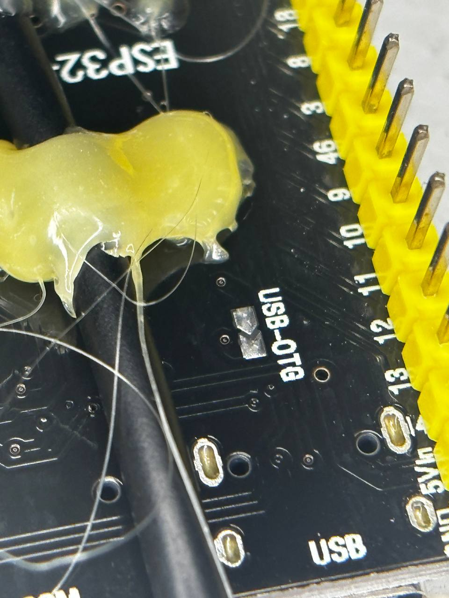
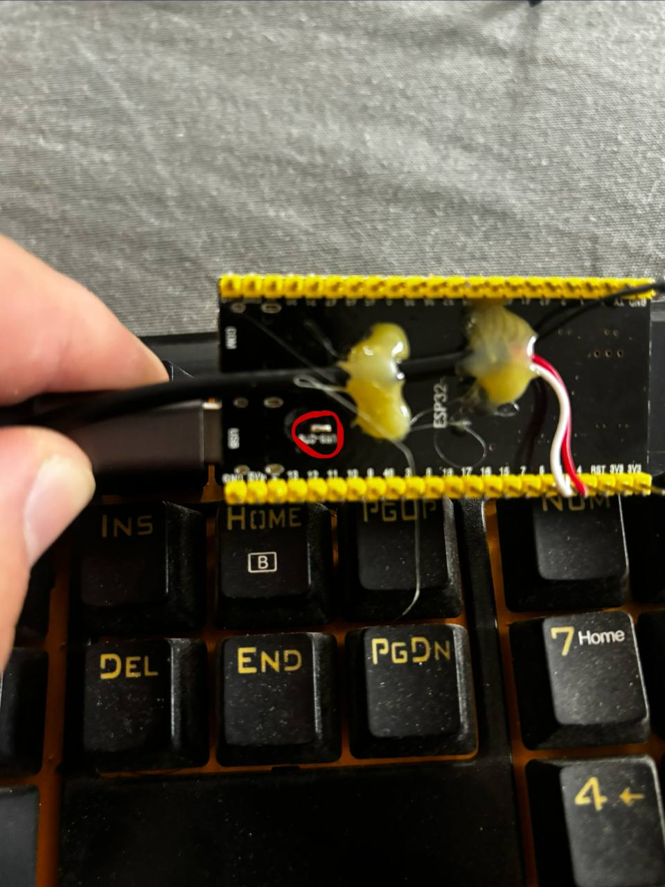
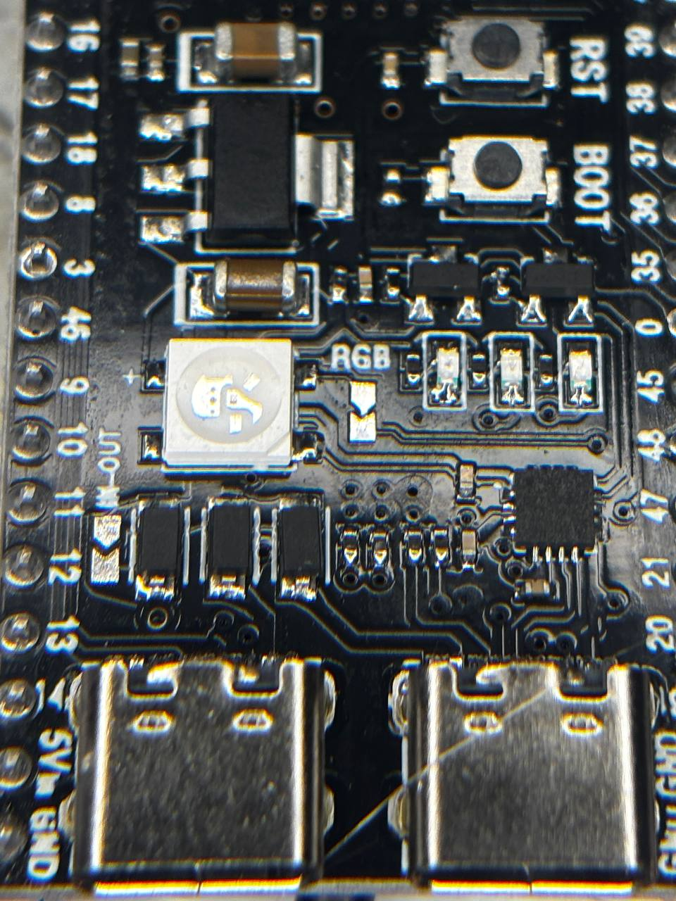
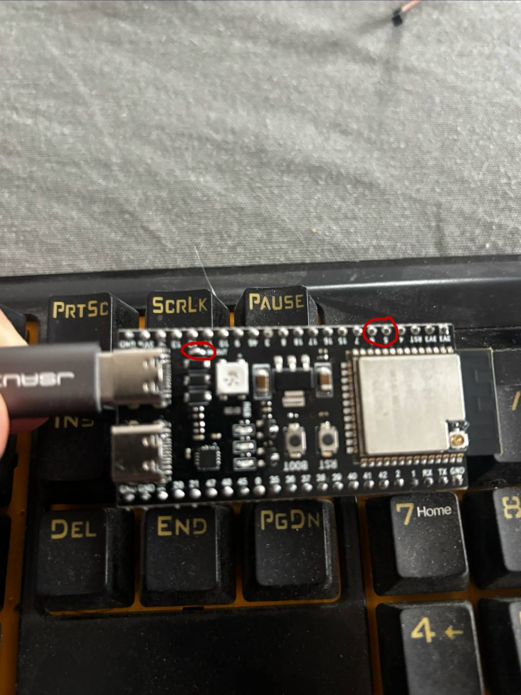
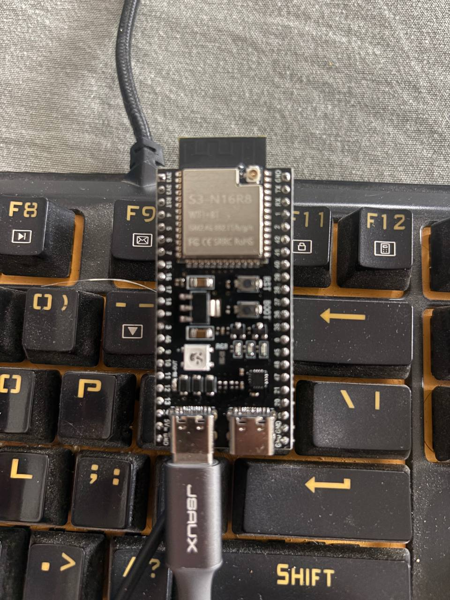
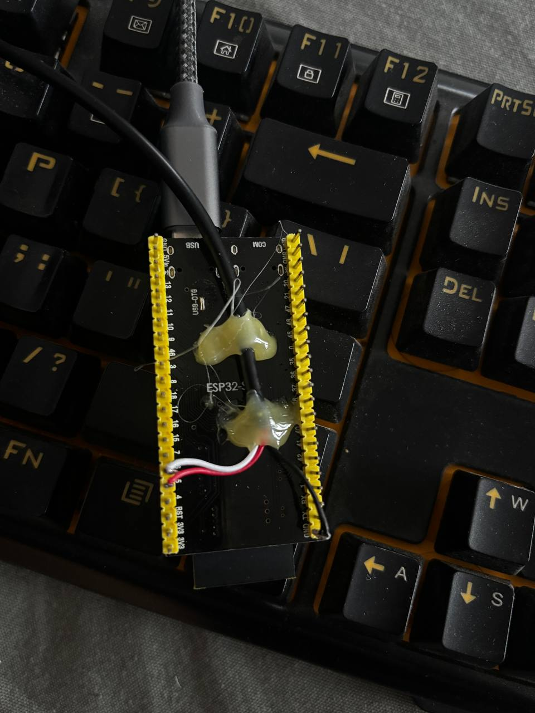

# CWPokeKey — USB keyboard adapter for CW Pokemon

Firmware for ESP32-S3 that converts input from a standard wired USB keyboard to PS/2 protocol, enabling its use with the 3.5mm TRS PS/2 jack of the [CW Pokemon](https://github.com/admvip/CW-Pokemon-Infomation).

## Goal

The [CW Pokemon](https://github.com/admvip/CW-Pokemon-Infomation) is a hardware device for amateur radio operators that decodes and generates Morse code (CW). It only accepts PS/2 keyboards through its 3.5mm TRS jack. This adapter bridges that gap using an ESP32-S3 as USB HID host and PS/2 bit-bang transmitter.

```
USB Keyboard  →  ESP32-S3 (USB OTG Host)  →  PS/2 bit-bang  →  3.5mm TRS jack  →  CW Pokemon
```

**CW Pokemon project (original hardware):** [github.com/admvip/CW-Pokemon-Infomation](https://github.com/admvip/CW-Pokemon-Infomation)

## Bill of materials

| Qty | Component | Notes |
|---|---|---|
| 1 | ESP32-S3-DevKitC-1 N16R8 | 16 MB flash, 8 MB PSRAM |
| 1 | Female stereo TRS 3.5mm pigtail (for soldering) | **Must be stereo** — see warning below |
| 1 | Stereo TRS 3.5mm cable (male-to-male) | Connects the adapter to the CW Pokemon |
| 1 | USB-C to USB-A OTG cable (male-to-female) | Connects the keyboard to the ESP32 OTG port |
| 1 | USB-C cable | Powers the ESP32 (right/UART port) |
| 1 | 5V USB power adapter | To power the ESP32 |
| — | Solder + soldering iron | PCB soldering |
| — | Hot glue gun | Secure and protect solder joints |

> **Warning:** The TRS jack must be **stereo** (3 contacts: TIP, RING, SLEEVE). A mono (TS, 2-contact) connector would short DATA to GND and could damage the CW Pokemon.

## TRS jack wiring (PS/2)

| TRS contact | PS/2 signal | ESP32-S3 GPIO |
|---|---|---|
| TIP | DATA | GPIO5 |
| RING | CLK | GPIO6 |
| SLEEVE | GND | GND |

**Enable keyboard mode on the CW Pokemon:** Menu → tipo de electrónico → **KeyB**

## Hardware modification — enable USB Host

The DevKitC-1 has two solder bridges on the PCB that must be closed for the left OTG port to work as a USB host and supply power to the keyboard. They are open by default. Simply apply a small drop of solder to bridge each one.

### USB-OTG bridge (back of the board)

Located on the back side, next to the left USB-C connector, labeled **USB-OTG**. Closing it enables VBUS (5V) output to power the keyboard.

| Open — factory default | Closed — add solder |
|:---:|:---:|
|  |  |

### IN-OUT bridge (front of the board)

Located on the front side, also near the OTG connector, labeled **IN-OUT**. Closing it sets the current direction to host mode (output). The two red circles in the photo mark both bridges already closed.

| Open — factory default | Closed — add solder |
|:---:|:---:|
|  |  |

### General view after modification

| Front side | Back side |
|:---:|:---:|
|  |  |

## Important electrical notes

- The CW Pokemon uses **3.3V logic** — no level shifter is needed.
- The **CLK (RING)** pin has an internal pull-up to **3.2V** on the CW Pokemon.
- The **DATA (TIP)** pin has an internal **~8 kΩ pull-down to GND** on the CW Pokemon.
- **CRITICAL — push-pull mode for DATA:** With the ESP32's internal 45 kΩ pull-up in open-drain mode, the DATA line only reaches ~0.5V because the CW Pokemon's 8 kΩ pull-down wins. The CW Pokemon reads DATA as constant LOW and all PS/2 data arrives corrupted. By configuring the GPIO in **push-pull** (active output) mode, the ESP32 actively drives 3.3V and overcomes the pull-down. Implemented in `firmware-s3/src/ps2.cpp`.

## LED indicator (WS2812 RGB, GPIO48)

| State | LED behavior |
|---|---|
| USB keyboard connected | Off |
| Waiting for keyboard | Blue, fast blink (~120 ms) |

## Build and flash

Requires [PlatformIO](https://platformio.org/) (VS Code extension or CLI).

```bash
cd firmware-s3
pio run              # build
pio run -t upload    # flash (port /dev/ttyACM0)
pio device monitor   # serial monitor (115200 baud)
```

### Keyboard layout selection

Edit `firmware-s3/platformio.ini`:

```ini
build_flags =
    -DLAYOUT_ES   ; Spanish QWERTY (default)
;   -DLAYOUT_US   ; US QWERTY
```

## Project structure

```
firmware-s3/              — Firmware (USB HID Host + PS/2 bit-bang)
├── platformio.ini
└── src/
    ├── config.h          — Pin assignments and constants
    ├── ps2.cpp/hpp       — PS/2 bit-bang driver (push-pull mode)
    ├── usb_kbd.cpp/hpp   — USB HID Host (ESP-IDF usb_host)
    ├── keymap.c/h        — HID keycode → PS/2 Set 2 scancode table
    └── main.cpp
s3Pictures/               — Hardware and soldering photos
debug/                    — Debug screenshots
```

## License

GNU General Public License v3.0

Copyright (C) 2026 mcamposv
